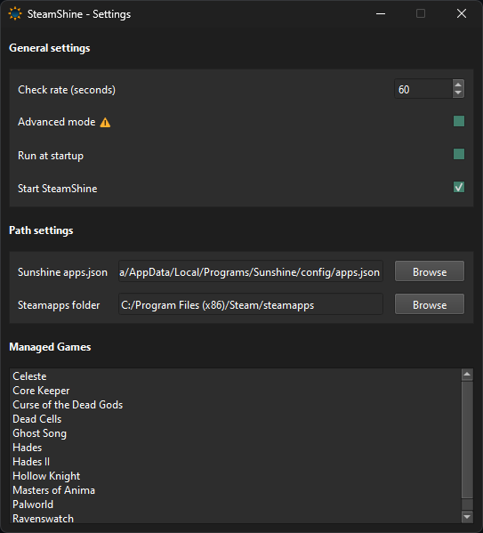

# SteamShine

Python daemon that checks for steam games and add them to sunshine app list.  
SteamShine will not erase your default sunshine apps.

## Download and install

Get latest build [here](https://github.com/Odizinne/SteamShine/releases/latest)  
Extract it somewhere in your user directory.  
Run `SteamShine.exe`

## Settings

⚠️SteamShine will not request for admin permissions.⚠️  
To use it, you have to install sunshine somewhere in your user directory (Anywhere under c:\users\your_user_name).

Fill `apps.json` and `steamapps folder` path.

- apps.json should be found in config folder, next to sunshine executable.  
- steamapps folder should usually be found in steam installation directory (`"C:\Program Files (x86)\Steam\steamapps"`)

Set check interval. SteamShine will only write to disk if an update in `apps.json` is needed.
Check `Start SteamShine` and close the window. SteamShine will periodically check for added or removed steam games.

## To-do
- Add ability to stop stream when stopping game
- Add ability to use multiple steamapps path
- Display a list of managed apps in settings